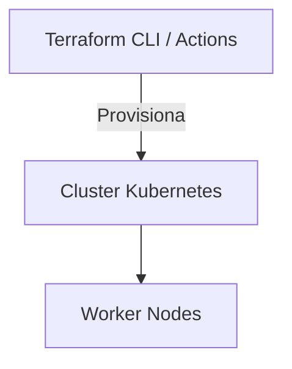

# Infraestrutura Kubernetes (Terraform)

## Descricao do Proposito
Este repositorio contem os scripts de Infraestrutura como Codigo (IaC) responsaveis por provisionar, configurar e gerenciar o Cluster Kubernetes (EKS) que hospedara a Aplicacao Principal da Oficina Mecanica.

## Tecnologias Utilizadas
- Terraform
- Kubernetes (K8s)
- GitHub Actions (CI/CD)

## Passos para Execucao e Deploy
O deploy e automatizado pela pipeline de CI/CD ao aprovar um Pull Request para a `main`.
Para execucao manual (via CLI):
1. `terraform init`
2. `terraform plan`
3. `terraform apply -auto-approve`

## Diagrama da Arquitetura Especifica

